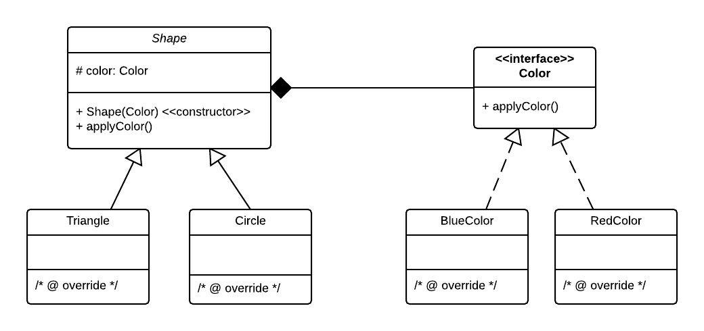

### Bridge Pattern

#### A structural pattern

Decouple an abstraction from its implementation so that the two can vary independently.

Source code stems from the following UML diagram:

(example taken from http://www.journaldev.com/dev/java/design-patterns credits Pankaj Kumar)

